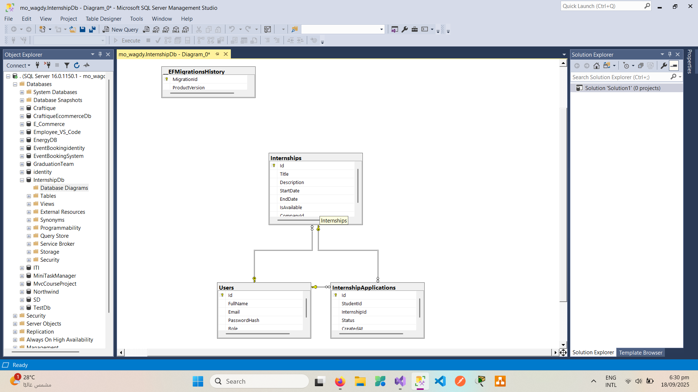

# 🅰 Internship Management System

## 1. Project Overview

The Internship Management System is a modern web-based platform designed to streamline the process of connecting students, companies, and universities for internship opportunities. It provides a centralized system for managing internships, applications, and evaluations, ensuring a seamless experience for all stakeholders.

### Key Features:

📝 **Student and Company Registration**: Secure registration and authentication using JWT.

📢 **Posting Internship Opportunities**: Companies can create and manage internship postings.

📬 **Students Apply for Opportunities**: Students can browse and apply for internships.

✅ **Accept / ❌ Reject Applications**: Companies can review and update application statuses.

📊 **Performance Reports and Evaluations**: (Planned) Evaluate student performance post-internship.

🛡 **Admin Panel**: Full management of users, internships, and applications.

🎯 **Purpose**: This project is designed for real-world use, educational purposes, and as a demo for showcasing modern .NET application architecture.

---

## 2. ⚙️ Technologies & Tools

- **Languages**: C# 12.0
- **Frameworks**: ASP.NET Core 8, Entity Framework Core
- **Architecture**: Clean Architecture (Domain, Application, Infrastructure, WebApi)
- **Database**: SQL Server (default), InMemory (for testing)
- **Authentication**: JWT (JSON Web Token)
- **API Documentation**: Swagger
- **Testing**: xUnit, Moq, ASP.NET Core TestServer
- **Design Patterns**: Repository Pattern, UnitOfWork Pattern

---

## 3. 🗂 Project Structure

```
├── Application/                 # Business logic, DTOs, interfaces, services
├── Domain/                      # Core entities, enums, domain interfaces
├── Infrastructure/              # Data access, repositories, DbContext, migrations, JWT services
├── WebApi/                      # API controllers, startup/configuration
├── InternshipManagement.Tests/  # Unit & integration tests
├── LICENSE.txt                  # License (GNU GPL v3)
├── Screenshots                  # Everything You'll Love to See
├── Readme.md                    # Project documentation
```

**Configuration Files:**
- `appsettings.json (WebApi)`: API, DB, JWT settings
- `Infrastructure/Migrations/`: EF Core migration files

**Swagger:**
- Enabled in WebApi for interactive API docs

---

## 4. 🛠 Getting Started (Setup & Installation)

### Prerequisites
- .NET 8 SDK
- SQL Server (or change connection string for another provider)
- (Optional) Visual Studio 2022 or VS Code

### Installation Steps
```bash
git clone https://github.com/yourusername/internship-management-system.git
cd internship-management-system

# Restore dependencies
dotnet restore

# Build the solution
dotnet build

# Update database (run migrations)
cd Infrastructure
dotnet ef database update

# Run the API
cd ../WebApi
dotnet run
```

The API will be available at **https://localhost:5001** (or as configured).

Access Swagger UI at **https://localhost:5001/swagger**.

**Note:**
- Update `appsettings.json` with your database connection string and JWT settings as needed.
- For seeding initial data, implement or enable a `DataSeedingService` (TODO: Add instructions if/when available).

---

## 5. 📌 Usage

### Example API Endpoints

**Register a User**
```http
POST /api/users/register
Content-Type: application/json

{
  "fullName": "Jane Doe",
  "email": "jane@example.com",
  "password": "StrongPassword123",
  "role": "Student"
}
```
**Response:**
```json
{ "message": "User Created Successfully" }
```

**Login**
```http
POST /api/users/login
Content-Type: application/json

{
  "email": "jane@example.com",
  "password": "StrongPassword123"
}
```
**Response:**
```json
{ "token": "eyJhbGciOiJIUzI1NiIsInR5cCI6IkpXVCJ9..." }
```

**Post Internship (Company)**
```http
POST /api/internships
Authorization: Bearer {token}
Content-Type: application/json

{
  "title": "Software Intern",
  "description": "Work on .NET projects",
  "startDate": "2024-09-01T00:00:00Z",
  "endDate": "2024-12-01T00:00:00Z",
  "companyId": "GUID"
}
```

**Apply for Internship (Student)**
```http
POST /api/internshipapplication
Authorization: Bearer {token}
Content-Type: application/json

{
  "studentId": "GUID",
  "internshipId": "GUID"
}
```

**Update Application Status (Company)**
```http
PUT /api/internshipapplication/{applicationId}/status
Authorization: Bearer {token}
Content-Type: application/json

{
  "applicationId": "GUID",
  "status": "Accepted"
}
```

**API Documentation**
- Interactive docs available at: **https://localhost:5001/swagger**

---

## 6. 🧪 Testing

- Unit & Integration Tests:
  - Located in `InternshipManagement.Tests/`
  - Uses xUnit and Moq for mocking dependencies
  - InMemory database setup for isolated, repeatable tests

Run all tests:
```bash
dotnet test
```

The test factory (`TestWebApplicationFactory`) configures the API to use an InMemory database for fast, reliable testing.

---

## 7. 🎥 Screenshots

## 📁 Entity Relationship Diagram (ERD)


---

## ⚙️ System Screenshots

### 🏗️ Project Structure


### 📝 Swagger API Documentation (1)


### 📝 Swagger API Documentation (2)


### 👶🏻 User Register (Postman)


### 👴🏻 User Login (Postman)


### 👥 Get Users (Postman)


### 📈 Company Creating Internship (Postman)


### 🧑🏻‍🦱 Student Applying For Internship (Postman)

---

## 8. 🚀 Improvements & Future Enhancements

- Add performance evaluation and reporting features
- University management (link students to universities, university dashboards)
- Notification system (email/SMS for application status updates)
- Advanced search and filtering for internships
- Role-based dashboards and analytics
- Enhanced error handling and logging
- API rate limiting and security hardening
- Docker support for easier deployment
- Frontend web client (React, Angular, or Blazor)

---

## 9. 🤝 Contributing

Contributions are welcome!

- Fork the repository and create a feature branch
- Submit pull requests with clear descriptions
- Report issues or suggest features via GitHub Issues
- Please follow the existing code style and add tests for new features

---

## 10. 📄 License

This project is licensed under the **GNU General Public License v3.0**.
See `LICENSE.txt` for details.

---

## 📬 Contact

For inquiries or contributions:
- 📧 **mohamed5wagdy@gmail.com**
- 📱 **01554503750**
- 🔗 **LinkedIn**: [muhammed-fouda](https://www.linkedin.com/in/muhammed-fouda)

---
